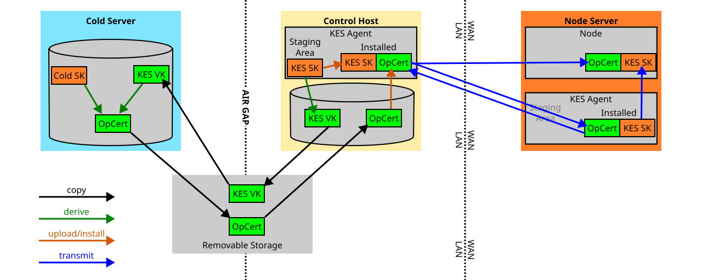

KES Agent User Guide
====================

Introduction
------------

Key Evolving Signature (KES) cryptography is a cryptographic signing scheme
where one verification key (VerKey) covers a series of signing keys (SignKey),
such that:

- Any signature created with any of the SignKeys can be verified with the same
  VerKey.
- Future SignKeys can be derived ("evolved") from past ones, but not the other
  way around, up to a maximum number of evolutions.

We use this in Cardano in order to achieve a degree of *forward security*:

- The original SignKey of each series of evolutions is verified with an OpCert,
  and installed into a Node.
- Every 36 hours (one "KES Period"), the Node evolves the SignKey, and deletes
  the old evolution.
- Once we reach the end of a key's series of evolutions, a new key and OpCert
  must be generated and installed.

Once a key is deleted, it can no longer be leaked, and an attacker cannot infer
the old keys from newer evolutions, which means that any signature made with a
key gains forward security within no more than 36 hours of signing, at which
point the sign key will be deleted. However, because the same verification key
covers all evolutions of the key, there is no need to distribute a new
verification key for each evolution, which makes the 36-hour periods viable in
practice.

There is one caveat though: in order for all this to work, we need to actually
delete those keys, and because reliably erasing data from modern mass storage
devices (such as hard disks or SSDs) is not reliably achievable, we need to
handle the keys such that they are never stored on disk. However, we also need
the Node process to be able to restart, for various reasons, and without
external storage, this means the key would be lost after a restart.

This is where the KES Agent comes in, an external process that retains a KES
key in memory, and exchanges it with a locally connected Node. Great care is
taken to make sure that keys are never stored on disk, and that the RAM they
are stored in is protected against swapping out to disk ("mlocked"), and when
sending keys over a network socket, we do it such that the keys are moved
directly between mlocked memory and the socket file descriptors, without using
any intermediate data structures for serialization/deserialization.

Glossary
--------

If you are new to the KES Agent, these are the terms used throughout this guide
and the CLI output. They are explained in more depth in the sections that
follow.

- **KES key**: the "hot" Key Evolving Signature key used by a block-forging
  node to sign blocks. It exists in two parts: the **KES sign key** (secret,
  must never touch disk) and the **KES verification key** (public, used to build
  an OpCert).
- **KES period**: a ~36-hour window. The node evolves the KES sign key once per
  period and deletes the previous evolution; this is what provides forward
  security.
- **Cold key**: the long-lived identity key of the pool, kept on an air-gapped
  signing host. The **cold sign key** signs OpCerts and must never leave that
  host; the **cold verification key** (`cold.vkey`) is public and is used by the
  agent to verify OpCerts.
- **OpCert (operational certificate)**: a certificate, signed by the cold key,
  that authorises a particular KES verification key (with a serial number and a
  start KES period). It is what binds a KES key to your pool identity.
- **Staged key**: a freshly generated KES key held in the agent's staging area.
  It is *not yet active* and is not served to nodes — it is waiting for a
  matching OpCert.
- **Installed (active) key**: the KES key the agent has verified against an
  OpCert and is actively serving to connected nodes. When `kes-agent-control
  info` reports an *Installed KES SignKey*, this is what it means.
- **Service socket**: the socket on which the agent *serves keys*. Nodes (and
  other agents) connect here. Configured on the node with
  `--shelley-kes-agent-socket`.
- **Control socket**: the socket on which the agent *receives commands* from the
  `kes-agent-control` CLI (generate, install, drop keys, query info).
- **Bootstrap peer**: another agent this agent connects to in order to *receive*
  a key copy, providing redundancy. See
  [Recommended Setups](#recommended-setups) and the
  [Troubleshooting guide](troubleshooting.markdown).
- **Host roles**: the **node host** runs `cardano-node` and (usually) an agent;
  the **control host** runs `kes-agent-control`; the air-gapped **signing host**
  holds the cold sign key and issues OpCerts. These may be three machines or, in
  the simplest setup, fewer.

Design Overview
---------------

The KES Agent system consist of 3 components:

- The *Agent* itself, a standalone process that is responsible for:
    - Generating KES keys
    - Serving KES sign keys to a block-forging Cardano Node, and, optionally,
      other KES agent instances
    - Outputting KES verification keys, for the purpose of generating OpCerts.
  The KES agent accepts connections on two sockets:
    - A "service" socket, on which keys are sent out. Nodes and other KES
      agents will connect to this socket.
    - A "control" socket, on which commands are received. The Control Client
      will connect to this socket.
  The Agent will also autonomously evolve keys, such that any keys it sends out
  on demand will match the current KES period on the ledger. Further, while the
  KES Agent can generate new KES keys, they have to be signed externally. Any
  newly generated keys will be held in a *staging area* inside the KES agent
  process until a matching OpCert is added, at which point the key is activated
  and sent out to any connected clients.
- The *Node* (cardano-node), which connects to an Agent's "service" socket, and
  receives keys upon first connecting and when a fresh key is pushed to the
  Agent. Once the Node has received a valid key, it will evolve it
  autonomously, so there is no need for the Agent to send out subsequent
  evolutions of the same key, unless the Node reconnects. The latter normally
  only happens when a Node process restarts.
- The *Control Client* (`kes-agent-control`), a command-line utility used to
  generate staged KES keys, install operational certificates, and query the
  state of a running Agent via the "control" socket. It is typically run from
  a management host with access to the Agent's control socket.

This package contains:

- The `kes-agent` binary (the Agent).
- The `kes-agent-control` binary (the Control Client, used to interact with
  running `kes-agent` processes).
- The `kes-agent` library that contains shared code for all of the above as well
  as client code to be used in `cardano-node`.
- A test suite.
- The `kes-service-client-demo` binary, which implements the service client
  protocol and can be used as a mock `cardano-node` for testing and
  demonstration purposes.
- The `kes-agent-protodocs` binary, a tool that will output documentation of
  the KES Agent protocols as used in the current versions of the library.
  **This part is currently disabled due to dependency issues.**

We also need a CLI tool for signing KES keys and metadata, producing
*Operational Certificates* ("OpCerts"). `cardano-cli` already has functionality
for this built into it, so we are not providing one from the `kes-agent`
package.

Summarizing, the following data is handled by the system; items that are
sensitive to leaks are in **boldface**.

- **KES Sign Key**: the "hot" sign key that is used in `cardano-node` to sign
  blocks. This key must never be stored on disk.
- KES Verification Key: the verification key matching the KES sign key.
- **Cold Sign Key**: a DSIGN key used to sign KES keys and metadata. This key
  needs to be stored on a disk, but that disk must be airgapped from the
  internet at all times, because an attacker in possession of the cold sign key
  can fabricate KES sign keys at will.
- Cold Verification Key: the verification key matching the cold sign key. This
  key is used to verify OpCerts.
- OpCert (Operational Certificate) - consists of:
    - KES Verification Key
    - Serial Number (ascending, and unique across all OpCerts signed with the
      same cold key; this is used for various consistency checks, and to avoid
      overwriting newer keys with older ones)
    - KES Period (the KES period, `(current_timestamp - genesis) /
      slots_per_kes_period`, from which the KES key's 0th evolution is valid)
    - Sigma (a DSIGN signature of the above 3 items)

Data flow works as follows:

1. Run `kes-agent-control` on a regular (but trusted) computer (the "control
   host"), using the `gen-staged-key` command. This will make the KES Agent generate
   a new KES Sign Key, keep it in its staging area, and write the corresponding
   KES Verification Key to a local file.
2. Copy the KES Verification Key to an air-gapped key signing host that
   holds the Cold Verification Key (using a secure removable storage medium -
   we cannot use a network connection, as that would defeat the air-gapping).
3. On the air-gapped machine, generate an OpCert.
4. Copy the OpCert back to the control host.
5. Run `kes-agent-control` to load the OpCert and push it to the KES Agent.
6. KES Agent verifies the OpCert against the staged sign key, moves them to the
   "active" slot, and pushes them to any connected Nodes.  KES Agent will also
   independently evolve the KES Key as time passes; this is important, because
   we won't get full forward security if we keep old evolutions of the key
   around anywhere, including the Agent.

This way, sensitive items are handled correctly:

- The **Cold Sign Key** never leaves the air-gapped signing host; it can be
  securely erased by physically destroying the signing host (or its mass
  storage devices)
- The **KES Sign Key** is only kept in secure memory, and transmitted over
  network connections without using intermediate data structures that could
  cause the key data to be written to swap space. Memory used for storing keys
  and seeds uses `mlock`, a kernel feature that prevents it from being swapped
  out, and employs a few other techniques to harden it against various attacks.

The following figure illustrates the data flow with two agents, one node, and a
cold server for generating OpCerts.



Installation
------------

### System Hardening Recommendations

This section outlines general security recommendations for hosts running the KES Agent. These recommendations are measures intended to reduce the risk of sensitive material being written to persistent storage.

**Threat model reminder:** The KES Agent is designed to prevent access to **past** KES key evolutions. It is assumed that an attacker who fully compromises the host may gain access to the **current** KES evolution. The recommendations below are focused on avoiding accidental persistence of sensitive material (e.g., via swap, crash dumps, or hibernation), not on preventing live compromise.

* **Disable Swap:** It is strongly recommended to permanently disable swap at runtime and ensure it is not re-enabled on reboot. 

* **Disable Hibernation and Suspend:** Power management features (like hibernation, suspension, and hybrid sleep) that write RAM contents to disk must be disabled. These features are not appropriate for always-on server workloads.

* **Disable Core Dumps and Crash Dumps:** Disable core dumps at the system and service level (e.g., systemd-coredump or kdump). This reduces the risk of sensitive in-memory material being written to disk during abnormal process termination.

* **Hardened SSH Access:** Use OpenSSH configured to use the memory locking feature, typically enabled via the `--with-linux-memlock-onfault` flag if available in your distribution's package or a custom build. This provides an additional layer of memory security for the SSH daemon itself.

### Using a tarball

1. Download a suitable installer tarball for your OS and architecture.
2. Unpack
3. Run the included `./install.sh` script as root

This will install `kes-agent` as a systemd service. To actually use it, the
following steps are required:

1. Copy your cold key file (`cold.vkey`) into `/etc/kes-agent/cold.vkey`
2. Edit `/etc/kes-agent/agent.toml` as desired
3. Reload the `kes-agent` configuration (`systemctl reload kes-agent`).

### Building From Source

#### Build Prerequisites

- The `git` version control system
- The `gcc` compiler, including C++ support (and `make`, `autoconf`, `libtool`,
  `pkg-config`)
- GHC, the Haskell compiler, and the Haskell build tool, Cabal (we recommend
  installing both via [GHCup](https://www.haskell.org/ghcup/))
- The C cryptography libraries `libsodium` (IOG fork), `secp256k1`, and
  `libblst`, described below.

These are **exactly the same C cryptography libraries that `cardano-node`
requires** — including the IOG fork of `libsodium`, not the stock distribution
package. The authoritative, maintained instructions live in the Cardano
developer portal, under
[Installing cardano-node → C library dependencies](https://developers.cardano.org/docs/get-started/infrastructure/node/installing-cardano-node/#c-library-dependencies);
follow that page and keep the versions in sync with the `cardano-node` release
you are targeting.

**If you already build `cardano-node` from source on this host, these libraries
are already installed and you can skip this section.**

For convenience, the commands below mirror that guide. They use version
variables pinned by `iohk-nix` (`IOHKNIX_VERSION`, `SODIUM_VERSION`,
`SECP256K1_VERSION`, `BLST_VERSION`); set them as shown in the developer-portal
guide so you build the exact revisions `cardano-node` expects.

```sh
mkdir -p ~/src && cd ~/src
```

**`libsodium` (IOG fork):**

```sh
git clone https://github.com/intersectmbo/libsodium
cd libsodium && git checkout $SODIUM_VERSION
./autogen.sh && ./configure
make && sudo make install
cd ~/src
```

**`secp256k1`:**

```sh
git clone --depth 1 --branch ${SECP256K1_VERSION} https://github.com/bitcoin-core/secp256k1
cd secp256k1
./autogen.sh && ./configure --enable-module-schnorrsig --enable-experimental
make && sudo make install
cd ~/src
```

The `--enable-module-schnorrsig --enable-experimental` flags are required; the
library will build without them but Cardano code will fail to link.

**`libblst`:** upstream does not ship an installer, so the headers, the static
library, and a `pkg-config` entry must be placed by hand:

```sh
git clone --depth 1 --branch ${BLST_VERSION} https://github.com/supranational/blst
cd blst && ./build.sh
cat > libblst.pc << EOF
prefix=/usr/local
exec_prefix=\${prefix}
libdir=\${exec_prefix}/lib
includedir=\${prefix}/include
Name: libblst
Description: Multilingual BLS12-381 signature library
URL: https://github.com/supranational/blst
Version: ${BLST_VERSION#v}
Cflags: -I\${includedir}
Libs: -L\${libdir} -lblst
EOF
sudo cp libblst.pc /usr/local/lib/pkgconfig/
sudo cp bindings/blst_aux.h bindings/blst.h bindings/blst.hpp /usr/local/include/
sudo cp libblst.a /usr/local/lib
sudo chmod u=rw,go=r /usr/local/{lib/{libblst.a,pkgconfig/libblst.pc},include/{blst.{h,hpp},blst_aux.h}}
cd ~/src
```

Finally, make sure the dynamic linker and `pkg-config` can find the libraries
you just installed (add these to your shell profile to make them permanent):

```sh
export LD_LIBRARY_PATH="/usr/local/lib:$LD_LIBRARY_PATH"
export PKG_CONFIG_PATH="/usr/local/lib/pkgconfig:$PKG_CONFIG_PATH"
```

#### Building KES Agent

1. Check out source code from github:
    ```sh
    git clone https://github.com/input-output-hk/kes-agent ./kes-agent
    ```
2. Build and install with cabal:
    ```sh
    cd kes-agent
    cabal update
    cabal install exe:kes-agent exe:kes-agent-control
    ```

##### Building on one host and installing on another

You usually do **not** want to install GHC, Cabal, and the build toolchain on a
hardened block producer. Instead, build on a separate workstation that runs the
**same OS and architecture** as the block producer, then copy the binaries
across.

The repository ships a helper that builds `kes-agent` and packages it together
with the systemd unit files and `install.sh` into a versioned tarball:

```sh
./scripts/make-release-bundle.sh
# produces dist/kes-agent-<version>-<arch>.tar.gz
```

Copy that tarball to the target host, unpack it, and run the bundled
`./install.sh` (see [Using a tarball](#using-a-tarball)). Note that the binaries
are dynamically linked against `libsodium` and `secp256k1`, so the **same shared
libraries must also be present on the target host** (`libblst` is linked
statically and does not need to be installed there). The build and target hosts
must have compatible `glibc` versions; building on the same OS release as the
target is the simplest way to guarantee this.

#### Installing KES Agent

KES Agent can run in two modes:

- "Service Mode" (`kes-agent start/stop/restart/status`), in which it acts as
  a Unix daemon. When started, it will double-fork and drop privileges, and it
  will send all log output to syslog. This is the recommended mode for a
  production setup.
- "Normal Mode" (`kes-agent run`), in which it runs as a regular foreground
  process; it does not fork or drop privileges, and writes log output to
  stdout. This mode is mainly useful for debugging and development; it is not
  recommended for production use.

To run KES Agent as a daemon using systemd, the following steps are necessary:

1. Install the `kes-agent` binary into a suitable location, e.g.
   `/usr/local/bin`.
2. Create a kes-agent system user and group; the default name for both is
   `kes-agent`, and we suggest to keep this.
3. Add all users that need to connect to
   the KES Agent (whether as a Node or via the `kes-agent-control` tool) to the
   `kes-agent` group.
4. Obtain a verification key for your Cold Key and copy it into a suitable
   location (e.g. `/etc/kes-agent/cold.vkey`). KES Agent needs this file in
   order to verify OpCerts.
5. Make a systemd service to drive the `kes-agent` binary. An example service
   file can be found in `./systemd/etc/systemd/system/kes-agent.service`.
6. Create an environment file for the systemd service to configure it. An
   example file can be found in `./systemd/etc/kes-agent/kes-agent.env`.
7. Make systemd reload the service configuration (`systemctl daemon-reload`).
8. Start the kes-agent service (`systemctl start kes-agent`).

An example installation script that performs the above steps is provided in
`etc/systemd/install.sh`.

#### Installing KES Agent Control

Simply put the `kes-agent-control` binary somewhere on your `$PATH`.

To tell `kes-agent-control` where to find the KES agent, you can use the
following methods:

1. Set up the kes-agent to listen for control connections on the default path,
   `/tmp/kes-agent-control.socket`. Note that for production use a path under
   `/run/kes-agent/` (e.g. `/run/kes-agent/control.socket`) is recommended, as
   it benefits from systemd's socket lifecycle management.
2. Pass the control socket path as a command-line argument to
   `kes-agent-control`, using the `--control-address` or `-c` option.
   This takes precedence over the environment variable below.
3. Pass the control socket path through the environment, by setting the
   `KES_AGENT_CONTROL_PATH` environment variable to the desired path.

### Setting Up An Air-gapped Signing Host

You need an "expendable" computer for this, such as a cheap single-board computer, that
never connects to the internet once set up. The only things that need to be
installed on this machine are:

- `cardano-cli`, for generating cold keys and OpCerts
- whatever software is needed to copy keys and OpCerts to and from a secure
  removable storage device

Now:

1. Generate a fresh Cold Key pair and a counter:
   ```sh
   cardano-cli node key-gen \
       --cold-verification-key-file cold.vkey \
       --cold-signing-key-file cold.skey \
       --operational-certificate-issue-counter-file opcert.counter
   ```
2. Copy the cold *verification* key to removable storage, and move it to
   the control host:
   ```sh
   mount /path/to/secure/device /mnt/secure-device
   cp cold.vkey /mnt/secure-device/
   umount /mnt/secure-device
   ```
   **DO NOT COPY THE SIGN KEY** - the sign key must never leave the signing host.
For a more involved setup consider something like [this](https://github.com/perturbing/x86_64-linux-cold-machine/tree/main) cold machine setup.
### Configuring `cardano-node` To Use The KES Agent

> **Migrating an existing block producer?** For a complete, ordered walkthrough
> of moving a node that currently uses a `kes.skey` file on disk over to the
> agent — including the foreground-to-systemd transition — see the
> [Migration guide](migration.markdown).

> **Note:** KES Agent support was introduced in `cardano-node` 10.7.1. This is
> the minimum version required to use the `--shelley-kes-agent-socket` flag.

The only difference from the usual procedure is using the new flag
`--shelley-kes-agent-socket SERVICE_SOCKET_PATH` instead of using the kes.skey
from file.

```shell
cardano-node run \
  --config                          configuration.yaml \
  --topology                        node-spo1/topology.json \
  --database-path                   node-spo1/db \
  --socket-path                     node-spo1/node.sock \
  --shelley-kes-agent-socket        service.socket \
  --shelley-vrf-key                 node-spo1/vrf.skey \
  --shelley-operational-certificate opcert.cert \
  --port                            3001
```

### Running `cardano-node`, `kes-agent-control` And/Or `kes-agent` On Separate Hosts

By default, `kes-agent` uses Unix domain sockets for communication with both
the control CLI and the Node. This has several advantages:

- By controlling the permissions of the files that represent the sockets, we
  get OS-level access control "for free".
- Unix domain sockets use kernel buffers, which will not be leaked to swap
  space or otherwise end up on persistent mass storage.
- Since the connection remains on the local host, it does not need to be
  encrypted.

To run these 3 processes on different machines, one may use OpenSSH domain
socket forwarding; this will use the existing authentication and encryption
mechanisms built into OpenSSH, and the processes on either side will be
blissfully unaware of the fact that there is a network connection between them.

A simple command for setting up a tunnel from a host running `cardano-node` to
a host running `kes-agent` might look like this:

```sh
ssh kes-agent-host -L /tmp/kes-agent-service-remote.socket:/tmp/kes-agent-service.socket
```

However, in practice, you would want to add a few options to background the
`ssh` process, skip opening a terminal, and automatically delete the local
socket file if it already exists, like so:

```sh
ssh kes-agent-host \
    -L /tmp/kes-agent-service-remote.socket:/tmp/kes-agent-service.socket \
    -nNT \
    -o StreamLocalBindUnlink=yes \
    & disown
```

Further, if you want the ssh connection to be automatically resumed whenever it
gets disconnected, try `autossh`:

```sh
autossh -M0 \
    kes-agent-host \
    -L /tmp/kes-agent-service-remote.socket:/tmp/kes-agent-service.socket \
    -nNT \
    -o StreamLocalBindUnlink=yes \
    & disown
```

The options explained in detail:

- `-L /tmp/kes-agent-service-remote.socket:/tmp/kes-agent-service.socket`: this
  sets up the domain socket forwarding.
- `-n`: prevent reading from `stdin`.
- `-N`: do not execute a remote command.
- `-T`: disable pseudo-terminal allocation
- `-o StreamLocalBindUnlink=yes`: automatically delete (stale) local sockets if
  they clash with the newly created local sockets. Forwarded local socket files
  will remain on the local filesystem after the forwarding ssh process
  terminates, and subsequent attempts at binding the same address will fail;
  this option changes that, so that the existing file will instead be deleted.

You may also want to wrap this up in a systemd service; note however that you
must set up authentication in such a way that it never requires any user
interaction (e.g., asking for a password or passphrase).

For examples of bootstrapping and control socket forwarding in multi-agent
setups, see [Recommended Setups](#recommended-setups).

You can also set up the tunnel from the other side, using the `-R` option;
note, however, that there is no equivalent option to `StreamLocalBindUnlink`
that can clean up stale sockets on the remote, so you will have to take care of
that separately.

Usage
-----

This section is a concise reference for the key rotation procedure. For a
complete step-by-step walkthrough of initial setup (including starting the
agent and switching `cardano-node`), see
[Migrating From KES Key Files to KES Agent](#migrating-from-kes-key-files-to-kes-agent).

To generate and install a new KES sign key:

### On The Control Host

- Calculate the current KES period:
  ```sh
  slotsPerKESPeriod=$(jq -r '.slotsPerKESPeriod' shelley-genesis.json)
  currentSlot=$(cardano-cli query tip --mainnet | jq -r '.slot')
  kesPeriod=$(( currentSlot / slotsPerKESPeriod ))
  echo "KES period: $kesPeriod"
  ```
  > **Note:** Replace `--mainnet` with `--testnet-magic <network-magic>` if on
  > a testnet.

- Generate a new staged key:
  ```sh
  kes-agent-control --control-address /run/kes-agent/control.socket \
    gen-staged-key --kes-verification-key-file kes.vkey
  ```
- Copy `kes.vkey` and the KES period value to your secure removable storage
  device.

### On The Signing Host

- Copy `kes.vkey` from the secure removable storage device.
- Generate an OpCert (substituting your calculated KES period for `<N>`):
  ```sh
  cardano-cli node issue-op-cert \
    --kes-verification-key-file               kes.vkey \
    --cold-signing-key-file                   cold.skey \
    --operational-certificate-issue-counter-file opcert.counter \
    --kes-period <N> \
    --out-file opcert.cert
  ```
- Copy `opcert.cert` to the secure removable storage device.

### On The Control Host

- Copy `opcert.cert` from the secure removable storage device.
- Install the key:
  ```sh
  kes-agent-control --control-address /run/kes-agent/control.socket \
    install-key --opcert-file opcert.cert
  ```
- Verify the key is active:
  ```sh
  kes-agent-control --control-address /run/kes-agent/control.socket info
  ```

Migrating From KES Key Files to KES Agent
-----------------------------------------

If you are currently running a block-producing node with KES keys stored on disk
(`kes.skey` / `kes.vkey`), this section walks you through migrating to the KES
Agent without interrupting block production.

**What changes:** Instead of passing `--shelley-kes-signing-key kes.skey` to
`cardano-node`, you will pass `--shelley-kes-agent-socket` pointing to a local
Unix socket managed by the KES Agent. The KES Agent holds the sign key in
mlocked memory; the key never touches disk.

**What stays the same:** Your cold key, VRF key, pool registration, and opcert
counter are all unchanged. You will issue a fresh opcert as part of this
migration (which increments the counter), but your pool identity is unaffected.

In the steps below, *block-producer host* refers to the machine running
`cardano-node`. In many SPO setups this is the same machine from which
`kes-agent-control` is run; if yours differs, ensure the control socket is
accessible from your management machine (e.g. via SSH socket forwarding, as
described in [Running on Separate Hosts](#running-cardano-node-kes-agent-controland-or-kes-agent-on-separate-hosts)).

### Prerequisites

- `cardano-node` 10.7.1 or later (the first version with KES Agent support)
- A running block-producing node with:
    - `cold.vkey` available on the block-producer host
    - `cold.skey`, `opcert.counter`, and `cardano-cli` on your air-gapped signing host
    - `vrf.skey` on the block-producer host
    - A current `opcert.cert`
- `kes-agent` and `kes-agent-control` installed on the block-producer host
  (see [Installation](#installation))
- `cardano-cli` and `jq` available on the block-producer host

### Step 1 — Start the KES Agent

On your block-producer host, start `kes-agent` pointing to your existing cold
verification key. The agent will listen on two sockets: a *service* socket for
the node, and a *control* socket for the CLI:

```sh
kes-agent run \
    --service-address  /run/kes-agent/service.socket \
    --control-address  /run/kes-agent/control.socket \
    --cold-verification-key /path/to/cold.vkey \
    --genesis-file /path/to/shelley-genesis.json
```

> **Note:** Choose socket paths that suit your setup. The service socket must
> be readable by the user running `cardano-node`; the control socket must be
> readable by the user running `kes-agent-control`. For production use, run
> `kes-agent` as a systemd service (see [Installing KES Agent](#installing-kes-agent)).

Your existing `cardano-node` continues running normally with `kes.skey` while
you complete the remaining steps.

### Step 2 — Generate a New KES Key

Ask the KES Agent to generate a new KES sign key. The sign key is created
inside the agent's secure memory and never written to disk. Only the
verification key is written to a file, which you will need for the opcert:

```sh
kes-agent-control --control-address /run/kes-agent/control.socket gen-staged-key \
    --kes-verification-key-file kes.vkey
```

Transfer `kes.vkey` to your air-gapped signing host.

### Step 3 — Issue a New Operational Certificate

On the block-producer host, calculate the current KES period:

```sh
slotsPerKESPeriod=$(jq -r '.slotsPerKESPeriod' shelley-genesis.json)
currentSlot=$(cardano-cli query tip --mainnet | jq -r '.slot')
kesPeriod=$(( currentSlot / slotsPerKESPeriod ))
echo "KES period: $kesPeriod"
```

> **Note:** `cardano-cli query tip` reads the node socket from the
> `CARDANO_NODE_SOCKET_PATH` environment variable. Ensure it is set to your
> node's socket path before running this command. Replace `--mainnet` with
> `--testnet-magic <network-magic>` if you are on a testnet.

Transfer the calculated KES period value to your air-gapped signing host.
On the air-gapped signing host, issue the opcert, substituting the period
value you calculated above for `<N>`:

```sh
cardano-cli node issue-op-cert \
    --kes-verification-key-file              kes.vkey \
    --cold-signing-key-file                  cold.skey \
    --operational-certificate-issue-counter-file opcert.counter \
    --kes-period <N> \
    --out-file opcert.cert
```

Transfer `opcert.cert` back to the block-producer host.

> **Important:** Issuing a new opcert increments `opcert.counter`. Keep this
> file safe — submitting a certificate with a counter value lower than a
> previously used one will make your pool ineligible to produce blocks.

### Step 4 — Activate the Key

On the block-producer host, push the new `opcert.cert` to the KES Agent.
This verifies it against the staged key, activates it, and makes it
immediately available to any connected node:

```sh
kes-agent-control --control-address /run/kes-agent/control.socket install-key \
    --opcert-file opcert.cert
```

Verify the agent is holding a valid key:

```sh
kes-agent-control --control-address /run/kes-agent/control.socket info
```

Expected output:

```
--- Agent ---
Agent version: <version>
Connected via: /run/kes-agent/control.socket
Current time: 2025-01-10 12:05:00 UTC
Current KES period: 521
Current KES period started: 2025-01-10 12:00:00 UTC
Next KES period starts: 2025-01-11 00:00:00 UTC
--- Installed KES SignKey ---
Timestamp: 2025-01-10 12:04:30 UTC
VerKey: <hex>
Valid from period: 521
Current evolution: 0 / 64
OpCert number: 3
OpCert signature: <hex>
--- Bootstrap Peers ---
/run/kes-agent/peer.socket: up
```

The `--- Bootstrap Peers ---` section only appears when the agent was started with
one or more `--bootstrap-address` flags. Each peer is listed with its socket path
and current connection status (`up` or `down`).

Check that `Current KES period` matches your calculated value and that
`OpCert number` is one higher than your previous opcert.

### Step 5 — Switch the Node to KES Agent Mode

Stop `cardano-node`. Modify its startup command, replacing the KES signing key
flag with the agent socket, and ensure the new `opcert.cert` (issued in Step 3)
is referenced:

**Before:**
```sh
cardano-node run \
    --config                          configuration.json \
    --topology                        topology.json \
    --database-path                   db \
    --socket-path                     node.socket \
    --shelley-kes-signing-key         kes.skey \
    --shelley-vrf-key                 vrf.skey \
    --shelley-operational-certificate opcert.cert \
    --port 3001
```

**After:**
```sh
cardano-node run \
    --config                          configuration.json \
    --topology                        topology.json \
    --database-path                   db \
    --socket-path                     node.socket \
    --shelley-kes-agent-socket        /run/kes-agent/service.socket \
    --shelley-vrf-key                 vrf.skey \
    --shelley-operational-certificate opcert.cert \
    --port 3001
```

The node will connect to the KES Agent and receive the current sign key
automatically. Once you have confirmed the node is producing blocks, you can
safely delete `kes.skey` from the block-producer host — it is no longer needed
and keeping it on disk defeats the purpose of the KES Agent.

### Verifying KES Agent Status

After the node starts, check the agent to confirm the key is active:

```sh
kes-agent-control --control-address /run/kes-agent/control.socket info
```

To confirm actual block production, check your node logs for `TraceForgedBlock`
entries, or monitor the chain tip advancing from your block-producer socket.

From this point on, the KES Agent evolves the key autonomously every KES period.
If the node restarts for any reason, it reconnects to the agent and receives the
current key evolution automatically — no manual intervention required.

> **Next steps:** The setup above runs a single agent on the same machine as
> the node. For automatic recovery from agent restarts or host reboots, see the
> [Backup Agent On Control Host](#backup-agent-on-control-host) setup. Its
> "Setting It Up" guide builds directly on the commands used here.

Command Reference
-----------------

The full list of command line options for `kes-agent` and `kes-agent-control`
can be printed using the `--help` option.

Restart & Recovery
------------------

**Read this before going to production.** Because the KES sign key lives only in
memory, *what survives a restart depends on which process restarts*. The three
cases below behave very differently, and confusing them is the most common
source of operator error.

A node that has already received a valid KES key evolves it autonomously and can
keep forging blocks until that key reaches the end of its evolutions — even if
the agent is temporarily unavailable. A node only needs a working agent
connection **at startup** (and when you push a brand-new key). This is why a
brief agent outage does not, by itself, stop block production.

| Event | In-memory KES key | What you must do |
|-------|-------------------|------------------|
| **`cardano-node` process restarts** (agent stays up) | Agent keeps the key. | Nothing. The node reconnects to the service socket, is re-served the current evolution, and resumes forging automatically. |
| **KES agent restarts** (node stays up) | Agent **loses** its key. | **Single-agent:** reinstall a key (`gen-staged-key` → OpCert → `install-key`). The node keeps forging in the meantime on the key it already holds. **Backup-agent:** the restarted agent reconnects to its bootstrap peer and is re-served the key automatically (self-healing) — no action needed. |
| **Full host reboot** | Both agent and node lose their in-memory keys. | **Single-agent:** reinstall a key, then the node reconnects and is re-served. **Backup-agent on a separate host:** the surviving agent still holds the key; the rebooted agent bootstraps from it and the node reconnects automatically. |

In short: a **single-agent** setup trades a small amount of availability for
simplicity — an agent restart or host reboot requires a manual key
re-installation. A **backup-agent** setup (see
[Recommended Setups](#recommended-setups)) self-heals across these events at the
cost of extra moving parts. See also the
[FAQ](faq.markdown#design-considerations) and the
[Troubleshooting guide](troubleshooting.markdown).

Verifying A Correct Setup (Known-Good State)
--------------------------------------------

After migrating a node to the KES agent (or after any recovery action), run
through this checklist. When every item passes, the node is correctly forging
through the agent:

- [ ] `kes-agent-control info` reports an **Installed KES SignKey** (not only a
      staged key).
- [ ] The verification key shown by `kes-agent-control info` matches the KES
      verification key in the OpCert the node is using.
- [ ] The `cardano-node` process is started with
      `--shelley-kes-agent-socket` (pointing at the agent's service socket).
- [ ] The `cardano-node` process **no longer** uses `--shelley-kes-key` and no
      `kes.skey` file is referenced on the block producer.
- [ ] The node logs show `Forge.Loop.StartLeadershipCheck` (leadership checks
      are running).
- [ ] The node logs show KES info with sane `startPeriod` / `currPeriod` /
      `endPeriod` values, and `currPeriod` is within the start/end range.
- [ ] `cardano-cli query tip` works and reports `syncProgress` of `100.00`.
- [ ] The `kes-agent` systemd service is `active` (in a production systemd
      setup).

If any item fails, see the [Troubleshooting guide](troubleshooting.markdown).
**`kes-agent` subcommands:**

| Subcommand | Description |
|------------|-------------|
| `run`      | Start the agent in the foreground (Normal Mode). Useful for development and testing. |
| `start`    | Start the agent as a background daemon (Service Mode). Recommended for production. |
| `stop`     | Stop a running daemon. |
| `restart`  | Restart a running daemon. |
| `status`   | Report the status of a running daemon. |

**`kes-agent-control` subcommands:**

| Subcommand           | Description |
|----------------------|-------------|
| `gen-staged-key`     | Ask the agent to generate a new KES key; write the verification key to a file. |
| `install-key`        | Push an operational certificate to the agent, activating the staged key. |
| `info`               | Print the current state of the agent (active key, KES period, current evolution). |
| `drop-key`           | Remove the active key from the agent. |
| `drop-staged-key`    | Remove the staged (not yet activated) key. |
| `export-staged-vkey` | Write the staged key's verification key to a file without activating it. |

Recommended Setups
------------------

**Legend:**

- `---S-->`: service protocol connection (one-way)
- `<==S==>`: service protocol connection (two-way; this actually uses two
  separate network tunnels)
- `---C-->`: control protocol connection

In all setups, an air-gapped "cold key host" is assumed, which is used for
signing operational certificates based on verification keys extracted from a
running KES agent using the `kes-agent-control` CLI tool. This cold key host
should be located somewhere within convenient reach of the machine running the
`kes-agent-control` tool, but it should remain physically disconnected from any
networks at all times in order to protect the cold key.

Further, it is assumed that the SPO has some sort of local machine available
from where they control their cardano node; this machine is labelled the
"control host" in these example setups.

## Single-Agent

This is a simple setup that requires no extra hardware, since the only KES
Agent process runs on the same machine as the block-forging node.

    ------------ node host ------------
     +---------+      +--------------+
     | Agent A |<--S--| cardano-node |
     +---------+      +--------------+
          ^
          |
    ------|--- control host -----------
          C
          |
     +-------------------+
     | kes-agent-control |
     | (CLI)             |
     +-------------------+

### Properties:

- Key persists through network outages: YES
- Key persists through restart of cardano-node process: YES
- Key persists through restart of KES agent process: NO
- Key persists through reboots/hibernation of the node host: NO
- Recovery from cardano-node restart: automatic
- Recovery from agent process restart: manual via cold key host
- Recovery from node host reboot/hibernation: manual via cold key host
- Key updates possible during network outages: NO

### Recommended hardening:

- Set up SSH tunneling from the control host to the node host for the control
  socket only.
- Run the KES Agent under an locked-down user account that cannot log into a
  shell and can only access the files it needs (configuration files and local
  domain sockets for control and service connections).
- Keep the control host behind a firewall.

### Setting It Up

For the initial setup, follow the steps in the
[Migrating From KES Key Files to KES Agent](#migrating-from-kes-key-files-to-kes-agent)
section, starting `kes-agent` on the node host without a `--bootstrap-address`.

To access the control socket from the control host, forward it over SSH:

```sh
# On the control host
autossh -M0 node-host \
    -L /run/kes-agent/control.socket:/run/kes-agent/control.socket \
    -nNT \
    -o StreamLocalBindUnlink=yes \
    & disown
```

You can then run `kes-agent-control` commands from the control host as if the
agent were local:

```sh
kes-agent-control --control-address /run/kes-agent/control.socket info
```

## Backup Agent On Control Host

This setup is suitable for SPOs who use a control host that runs most of the
time; it does not require any additional hardware beyond the node host and the
control host, and offers a basic degree of redundancy and self-healing. Even if
the control host does not offer high availability, this setup supports
scheduled restarts of the node or the host it runs on, as long as the KES
agent on the control server remains active during the restart.

        ------------ node-host ------------
         +---------+      +--------------+
     +==>| Agent A |<--S--| cardano-node |
     |   +---------+      +--------------+
     |        
     S  --------- control host -----------------
     |   +---------+      +-------------------+
     +==>| Agent B |<--C--| kes-agent-control |
         +---------+      | (CLI)             |
                          +-------------------+

### Properties:

- Key persists through network outages: YES
- Key persists through restart of cardano-node process: YES
- Key persists through restart of KES agent process A: YES (as long as KES
  agent B remains available)
- Key persists through restart of KES agent process B: YES (as long as KES
  agent A stays up)
- Key persists through reboots/hibernation of the node host: YES (as long as
  KES agent B stays up)
- Key persists through reboots/hibernation of the control host: YES (as long as
  KES agent A stays up)
- Recovery from cardano-node restart: automatic
- Recovery from agent process restart: automatic
- Recovery from node host reboot/hibernation: automatic
- Recovery from control host reboot/hibernation: automatic
- Recovery from simultaneous restart of both agent processes: manual via cold
  key host
- Recovery from simultaneous reboot of both hosts: manual via cold
  key host
- Key updates possible during network outages: YES (updates will propagate once
  network connectivity is restored)

### Recommended hardening:

- Set up SSH tunneling from the control host to the node host for the service
  sockets only (one in each direction).
- Disable the control socket on Agent A.
- Run the KES agent A under an locked-down user account that cannot log into a
  shell and can only access the files it needs (configuration files and local
  domain sockets for control and service connections).
- Keep the control host behind a firewall.

### Setting It Up

**Step 1: Start Agent B on the control host**

Start Agent B without a `--bootstrap-address` initially — there is no peer to
bootstrap from yet:

```sh
# On the control host
kes-agent run \
    --service-address       /run/kes-agent/service.socket \
    --control-address       /run/kes-agent/control.socket \
    --cold-verification-key /path/to/cold.vkey \
    --genesis-file          /path/to/shelley-genesis.json
```

**Step 2: Set up SSH tunnels**

Each agent needs a local socket that forwards to the peer's service socket.
Because Unix domain sockets cannot span machine boundaries, this is done with
SSH socket forwarding (see
[Running on Separate Hosts](#running-cardano-node-kes-agent-controland-or-kes-agent-on-separate-hosts)):

```sh
# On the node host: forward Agent B's service socket locally
autossh -M0 control-host \
    -L /run/kes-agent/agent-b.socket:/run/kes-agent/service.socket \
    -nNT \
    -o StreamLocalBindUnlink=yes \
    & disown

# On the control host: forward Agent A's service socket locally
autossh -M0 node-host \
    -L /run/kes-agent/agent-a.socket:/run/kes-agent/service.socket \
    -nNT \
    -o StreamLocalBindUnlink=yes \
    & disown
```

**Step 3: Start Agent A on the node host**

Agent A exposes no control socket (hardening) and bootstraps from Agent B on
startup:

```sh
# On the node host
kes-agent run \
    --service-address       /run/kes-agent/service.socket \
    --bootstrap-address     /run/kes-agent/agent-b.socket \
    --cold-verification-key /path/to/cold.vkey \
    --genesis-file          /path/to/shelley-genesis.json
```

**Step 4: Restart Agent B with a bootstrap address**

Now that Agent A is running, restart Agent B with `--bootstrap-address` pointing
to the forwarded Agent A socket. This lets Agent B recover automatically while
Agent A stays up:

```sh
# On the control host
kes-agent run \
    --service-address       /run/kes-agent/service.socket \
    --control-address       /run/kes-agent/control.socket \
    --bootstrap-address     /run/kes-agent/agent-a.socket \
    --cold-verification-key /path/to/cold.vkey \
    --genesis-file          /path/to/shelley-genesis.json
```

**Step 5: Install the initial KES key**

From the control host, follow the same steps as in
[Migrating From KES Key Files to KES Agent](#migrating-from-kes-key-files-to-kes-agent):
generate a staged key, issue an operational certificate on the air-gapped host,
and install it:

```sh
# On the control host
kes-agent-control --control-address /run/kes-agent/control.socket \
    gen-staged-key --kes-verification-key-file kes.vkey

# Issue opcert on the air-gapped host (see migration tutorial) ...

kes-agent-control --control-address /run/kes-agent/control.socket \
    install-key --opcert-file opcert.cert
```

Once installed, the key propagates from Agent B to Agent A automatically.
Start `cardano-node` on the node host pointing to Agent A's service socket,
using the same command shown in
[Step 5 of the migration tutorial](#step-5--switch-the-node-to-kes-agent-mode)
(substituting `/run/kes-agent/service.socket` for Agent A's service socket path).

**Key rotation**

When it is time to rotate the KES key, repeat the key-setup steps above:
`gen-staged-key`, issue a new opcert on the air-gapped host, then `install-key`
via Agent B's control socket. The new key propagates to Agent A automatically.

## Basic 3-Agent Setup

This setup is suitable for SPOs who desire more redundancy for more reliable
persistence / automatic recovery, and are willing to provision an extra host
for that.

           ------------- node host -------------
             +---------+      +--------------+
      +=====>| Agent A |<--S--| cardano-node |
      |  +==>|         |      +--------------+
      |  |   +---------+
      |  |
      |  S ------------- agent host -------------
      |  |   +---------+
      S* +==>| Agent B |
      |  +==>|         |
      |  |   +---------+
      |  |        
      |  S ---------- control host -----------------
      |  |   +---------+      +-------------------+
      |  +==>| Agent C |<--C--| kes-agent-control |
      +=====>|         |      | (CLI)             |
             +---------+      +-------------------+

It is advisable to provision the agent host separately from the node host to
minimize the risk of agents A and B becoming unavailable simultaneously.

The connection between agents A and C, marked with an asterisk, is optional; it
allows agents A and C to stay in sync during times when agent B is down.

### Properties:

- Key persists through network outages: YES
- Key persists through restart of cardano-node process: YES
- Key persists through restart of KES agent process: YES (as long as at least
  one other KES agent process stays up)
- Key persists through reboots/hibernation of any host: YES (as long as at
  least one other KES agent process stays up)
- Recovery from cardano-node restart: automatic
- Recovery from agent process restart: automatic
- Recovery from node host reboot/hibernation: automatic
- Recovery from control host reboot/hibernation: automatic
- Recovery from simultaneous restart of up to 2 agent processes: automatic
- Recovery from simultaneous reboot of up to 2 hosts: automatic
- Recovery from simultaneous restart of all KES agents: manual via cold key
  host
- Recovery from simultaneous reboot/hibernation of all hosts: manual via cold
  key host
- Key updates possible during network outages: YES (updates will propagate once
  network connectivity is restored)


### Recommended hardening:

- Set up SSH tunneling from the control host to the agent and node hosts for
  the service sockets only (one in each direction), and from the agent host to
  the node host. Alternatively, if you want to avoid SSH connections into the
  node host, do not make the optional connection between agents A and C, and
  set up SSH tunnels for the connection between agents A and B from the node
  host. This way, only outgoing SSH connections need to be allowed from the
  node host (however, the agent host must accept incoming SSH connections).
- Disable the control socket on Agents A and B.
- Run KES agent A and B under locked-down user accounts that cannot log into a
  shell and can only access the files they need (configuration files and local
  domain sockets for control and service connections).
- Keep the control host behind a firewall.

### Setting It Up

Setup follows the same principles as
[Backup Agent On Control Host](#backup-agent-on-control-host), extended to the
additional agent host: start each agent, establish SSH socket tunnels between
all peers, and start each agent with `--bootstrap-address` entries pointing to
its peers' forwarded sockets. Only Agent C (on the control host) has a control
socket; key rotation via Agent C propagates to all peers automatically.

More Elaborate Setups
---------------------

The Basic 3-Agent Setup can be extended to arbitrarily many KES Agent hosts to
achieve the desired degree of redundancy and availability. Many topologies are
possible; the below diagrams show some basic options (only KES agents are
shown for clarity).

### Bilateral Linear

    +---+     +---+     +---+     +---+     +---+
    | A |<===>| B |<===>| C |<===>| D |<===>| E |
    +---+     +---+     +---+     +---+     +---+

Every agent connects to one or two peers.

Propagation will be disrupted whenever one agent goes down, and will be
restored once that agent comes back up.

### Ring

    +---+     +---+     +---+
    | A |<===>| B |<===>| C |
    +---+     +---+     +---+
      ^                   ^
      |                   |
      v                   v
    +---+               +---+
    | H |               | D |
    +---+               +---+
      ^                   ^
      |                   |
      v                   v
    +---+     +---+     +---+
    | G |<===>| F |<===>| E |
    +---+     +---+     +---+

Every agent connects to two peers.

Propagation will be disrupted whenever two agents go down, and will be restored
once one of them comes back up.

### Web

    +---+     +---+
    | A |<===>| B |
    +---+<   >+---+
      ^   \ /   ^
      |    X    |
      v   / \   v
    +---+<   >+---+
    | C |<===>| D |
    +---+     +---+

Every agent connects to every other agent.

Propagation is never disrupted between any two active agents.

Using As A Library
------------------

The `kes-agent` package also contains the `kes-agent` library, which provides
functionality for the agent itself, the control client, and any service
clients.

To implement KES agent connectivity in your own software, look at the modules
in kes-agent/src/Cardano/KESAgent/Processes/:

- kes-agent/src/Cardano/KESAgent/Processes/Agent.hs provides agent
  functionality. You will not need this unless you want to make your own KES
  client.
- kes-agent/src/Cardano/KESAgent/Processes/ControlClient.hs provides control
  client functionality (query the state of an agent process, requesting a new
  KES key to be generated, outputting the staged KES verification key,
  uploading OpCerts to activate the staged key, dropping the current key). You
  will need this if you want to make a custom frontend for controlling KES
  agents.
- kes-agent/src/Cardano/KESAgent/Processes/ServiceClient.hs provides service
  client functionality (receiving KES sign keys). You will need this if you
  want your application to connect to a KES agent.
